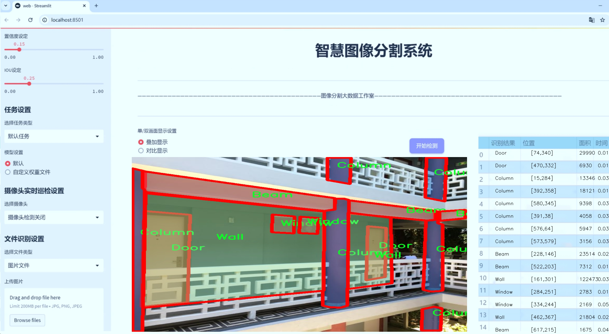
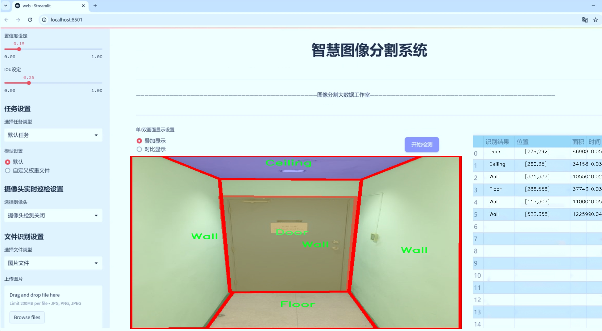
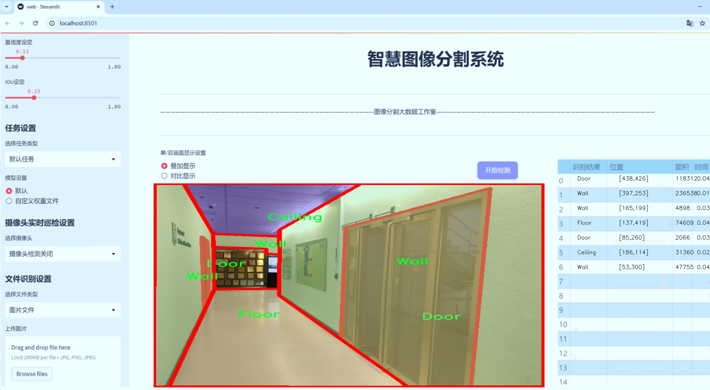
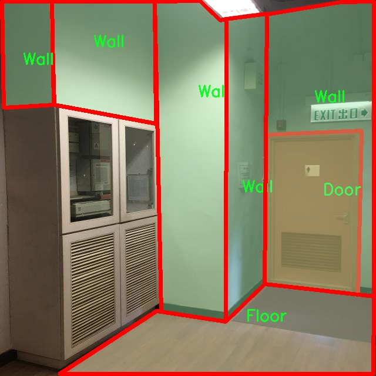
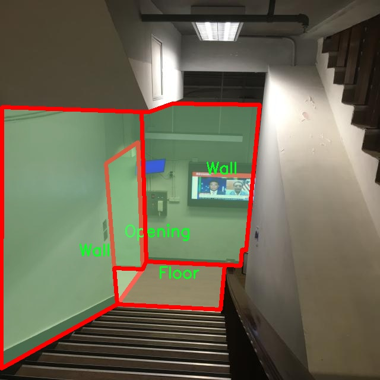
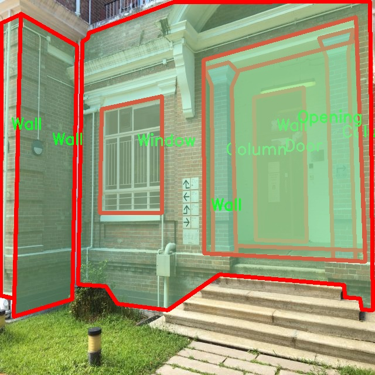
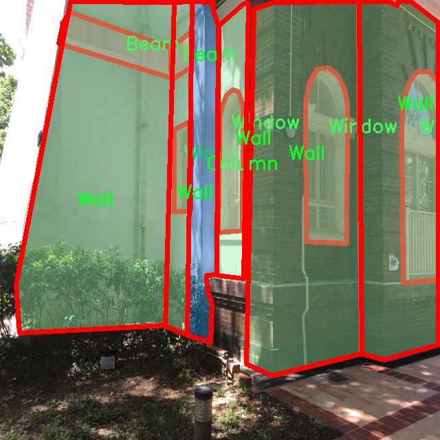
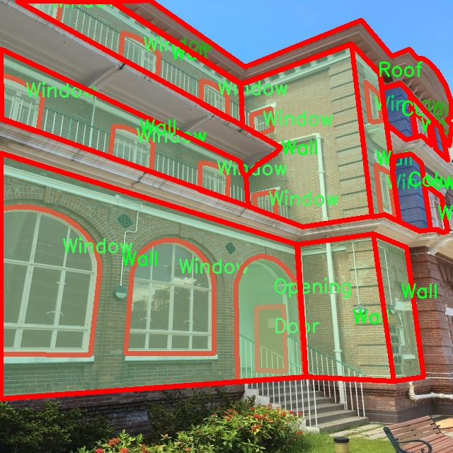

# 建筑室内结构图像分割系统源码＆数据集分享
 [yolov8-seg-C2f-ODConv＆yolov8-seg-bifpn等50+全套改进创新点发刊_一键训练教程_Web前端展示]

### 1.研究背景与意义

项目参考[ILSVRC ImageNet Large Scale Visual Recognition Challenge](https://gitee.com/YOLOv8_YOLOv11_Segmentation_Studio/projects)

项目来源[AAAI Global Al lnnovation Contest](https://kdocs.cn/l/cszuIiCKVNis)

研究背景与意义

随着城市化进程的加快，建筑行业的快速发展使得建筑设计、施工和维护的复杂性日益增加。在建筑设计阶段，准确识别和分割建筑室内结构元素（如梁、柱、墙、门、窗等）对提高设计效率、降低施工成本、优化空间利用具有重要意义。传统的建筑室内结构识别方法多依赖人工标注和经验判断，效率低下且容易出现误差。因此，基于计算机视觉的自动化图像分割技术逐渐成为研究的热点。

近年来，深度学习技术的快速发展为图像分割任务提供了新的解决方案。YOLO（You Only Look Once）系列模型因其高效的实时目标检测能力而受到广泛关注。YOLOv8作为该系列的最新版本，具备更强的特征提取能力和更高的检测精度，适用于复杂场景下的目标分割任务。然而，现有的YOLOv8模型在建筑室内结构图像分割中的应用仍然存在一定的局限性，主要体现在对细节特征的捕捉能力不足以及对不同类别结构元素的识别精度不高。因此，基于改进YOLOv8的建筑室内结构图像分割系统的研究具有重要的理论价值和实际意义。

本研究将利用包含3500张图像的建筑室内结构数据集，该数据集涵盖了12个类别的结构元素，包括梁、天花板、柱、幕墙、门、地板、电梯、开口、屋顶、墙壁和窗户等。这些类别的多样性为模型的训练提供了丰富的样本，有助于提高模型的泛化能力和适应性。通过对YOLOv8模型进行改进，结合先进的图像增强技术和特征融合策略，旨在提升模型在建筑室内结构图像分割任务中的表现，特别是在细节识别和复杂背景下的分割精度。

此外，建筑室内结构图像分割系统的研究不仅能够推动计算机视觉领域的技术进步，还能为建筑行业提供实用的工具和解决方案。通过实现高效、准确的室内结构识别，建筑设计师和工程师可以更快地获取结构信息，减少设计和施工中的错误，提高工作效率。同时，该系统还可以为建筑物的后期维护和管理提供数据支持，帮助管理者实时监测建筑结构的状态，提前发现潜在问题，降低安全隐患。

综上所述，基于改进YOLOv8的建筑室内结构图像分割系统的研究不仅具有重要的学术价值，也具备广泛的应用前景。通过本研究，期望能够为建筑行业的数字化转型提供新的思路和方法，推动智能建筑的发展，最终实现建筑设计与施工的智能化、自动化。

### 2.图片演示







##### 注意：由于此博客编辑较早，上面“2.图片演示”和“3.视频演示”展示的系统图片或者视频可能为老版本，新版本在老版本的基础上升级如下：（实际效果以升级的新版本为准）

  （1）适配了YOLOV8的“目标检测”模型和“实例分割”模型，通过加载相应的权重（.pt）文件即可自适应加载模型。

  （2）支持“图片识别”、“视频识别”、“摄像头实时识别”三种识别模式。

  （3）支持“图片识别”、“视频识别”、“摄像头实时识别”三种识别结果保存导出，解决手动导出（容易卡顿出现爆内存）存在的问题，识别完自动保存结果并导出到tempDir中。

  （4）支持Web前端系统中的标题、背景图等自定义修改，后面提供修改教程。

  另外本项目提供训练的数据集和训练教程,暂不提供权重文件（best.pt）,需要您按照教程进行训练后实现图片演示和Web前端界面演示的效果。

### 3.视频演示

[3.1 视频演示](https://www.bilibili.com/video/BV1y8yaYUEv9/)

### 4.数据集信息展示

##### 4.1 本项目数据集详细数据（类别数＆类别名）

nc: 12
names: ['Beam', 'Ceiling', 'Column', 'CurtainWall', 'Door', 'Floor', 'Lift', 'Opening', 'Roof', 'Wall', 'Window', 'object']


##### 4.2 本项目数据集信息介绍

数据集信息展示

在本研究中，我们使用的数据集名为“data”，旨在为改进YOLOv8-seg的建筑室内结构图像分割系统提供支持。该数据集包含12个类别，涵盖了建筑室内环境中常见的结构元素，具体类别包括：Beam（梁）、Ceiling（天花板）、Column（柱子）、CurtainWall（幕墙）、Door（门）、Floor（地板）、Lift（电梯）、Opening（开口）、Roof（屋顶）、Wall（墙）、Window（窗户）以及object（物体）。这些类别的选择不仅反映了建筑室内结构的多样性，也为模型的训练提供了丰富的标注信息。

数据集的构建过程经过精心设计，确保了图像的多样性和标注的准确性。每个类别的图像均来自不同类型的建筑，包括住宅、商业和公共建筑，涵盖了各种室内布局和设计风格。这种多样性使得模型在面对不同场景时，能够具备更强的适应能力和鲁棒性。此外，数据集中每个类别的样本数量经过合理分配，确保了模型在训练过程中能够获得足够的样本支持，从而提高其分割精度。

在数据集的标注过程中，采用了专业的标注工具，确保每个类别的边界清晰可辨。对于如Beam、Column和Wall等结构性元素，标注者在标注时特别注意了其在空间中的位置和相对关系，以便模型能够学习到这些元素在建筑室内环境中的特征和布局。同时，对于像Door、Window和CurtainWall这样的元素，标注者也考虑到了其在不同光照条件和视角下的表现，力求为模型提供真实的训练数据。

数据集中的图像不仅包括标准的室内照片，还涵盖了不同的拍摄角度和光照条件，以增强模型的泛化能力。例如，在某些图像中，可能会出现强烈的阴影或反射，这对于模型的训练是一个挑战，但同时也是提升其性能的机会。通过这样的设计，我们希望模型能够在实际应用中更好地处理复杂的室内环境。

为了评估模型的性能，我们还将数据集划分为训练集、验证集和测试集。训练集用于模型的训练，验证集用于调优模型参数，而测试集则用于最终的性能评估。这种划分方式确保了模型在未见数据上的表现能够真实反映其实际应用能力。

总之，数据集“data”不仅为改进YOLOv8-seg的建筑室内结构图像分割系统提供了丰富的训练资源，也为后续的研究和应用奠定了坚实的基础。通过对多样化类别的精确标注和合理的数据分配，我们期望能够显著提升模型在建筑室内结构图像分割任务中的表现，为智能建筑和室内设计领域的进一步发展提供有力支持。











### 5.全套项目环境部署视频教程（零基础手把手教学）

[5.1 环境部署教程链接（零基础手把手教学）](https://www.bilibili.com/video/BV1jG4Ve4E9t/?vd_source=bc9aec86d164b67a7004b996143742dc)


[5.2 安装Python虚拟环境创建和依赖库安装视频教程链接（零基础手把手教学）](https://www.bilibili.com/video/BV1nA4VeYEze/?vd_source=bc9aec86d164b67a7004b996143742dc)

### 6.手把手YOLOV8-seg训练视频教程（零基础小白有手就能学会）

[6.1 手把手YOLOV8-seg训练视频教程（零基础小白有手就能学会）](https://www.bilibili.com/video/BV1cA4VeYETe/?vd_source=bc9aec86d164b67a7004b996143742dc)


按照上面的训练视频教程链接加载项目提供的数据集，运行train.py即可开始训练



     Epoch   gpu_mem       box       obj       cls    labels  img_size
     1/200     0G   0.01576   0.01955  0.007536        22      1280: 100%|██████████| 849/849 [14:42<00:00,  1.04s/it]
               Class     Images     Labels          P          R     mAP@.5 mAP@.5:.95: 100%|██████████| 213/213 [01:14<00:00,  2.87it/s]
                 all       3395      17314      0.994      0.957      0.0957      0.0843

     Epoch   gpu_mem       box       obj       cls    labels  img_size
     2/200     0G   0.01578   0.01923  0.007006        22      1280: 100%|██████████| 849/849 [14:44<00:00,  1.04s/it]
               Class     Images     Labels          P          R     mAP@.5 mAP@.5:.95: 100%|██████████| 213/213 [01:12<00:00,  2.95it/s]
                 all       3395      17314      0.996      0.956      0.0957      0.0845

     Epoch   gpu_mem       box       obj       cls    labels  img_size
     3/200     0G   0.01561    0.0191  0.006895        27      1280: 100%|██████████| 849/849 [10:56<00:00,  1.29it/s]
               Class     Images     Labels          P          R     mAP@.5 mAP@.5:.95: 100%|███████   | 187/213 [00:52<00:00,  4.04it/s]
                 all       3395      17314      0.996      0.957      0.0957      0.0845


### 7.50+种全套YOLOV8-seg创新点代码加载调参视频教程（一键加载写好的改进模型的配置文件）

[7.1 50+种全套YOLOV8-seg创新点代码加载调参视频教程（一键加载写好的改进模型的配置文件）](https://www.bilibili.com/video/BV1Hw4VePEXv/?vd_source=bc9aec86d164b67a7004b996143742dc)

### 8.YOLOV8-seg图像分割算法原理

原始YOLOV8-seg算法原理

YOLOv8-seg算法是YOLO系列中最新的目标检测与分割模型，它在YOLOv5的基础上进行了多项创新与改进，旨在实现更高的检测精度和更快的推理速度。该算法的设计思路不仅关注目标检测，还将目标分割的任务纳入其中，形成了一个综合性的解决方案。YOLOv8-seg通过对网络结构的优化，尤其是在骨干网络、颈部网络和头部网络的设计上，显著提升了模型的性能。

首先，YOLOv8-seg的输入端采用了马赛克数据增强技术，这一技术通过将多张图像拼接在一起，生成新的训练样本，从而增强模型的鲁棒性和泛化能力。然而，YOLOv8-seg在训练的最后阶段停止使用马赛克增强，以避免对数据真实分布的破坏。自适应锚框计算和自适应灰度填充的引入，使得模型在处理不同场景时，能够灵活调整其输入特征，进一步提升了检测的准确性。

在骨干网络部分，YOLOv8-seg引入了C2f模块和SPPF（Spatial Pyramid Pooling Fusion）结构。C2f模块的设计灵感来源于YOLOv7的ELAN结构，通过增加分支跨层连接，显著丰富了梯度流，使得模型在特征学习时具备更强的表示能力。这种结构的优势在于能够更好地捕捉多尺度特征，从而提升目标检测的精度。SPPF模块则通过空间金字塔池化技术，有效地整合了不同尺度的特征信息，增强了模型对多样化目标的适应能力。

颈部网络采用了路径聚合网络（PAN）结构，这一设计的核心在于加强不同尺度对象特征的融合能力。PAN通过对特征图的有效聚合，确保了在进行目标检测时，模型能够综合考虑各个尺度的特征信息，从而提高了对小目标和大目标的检测性能。这种特征融合策略，使得YOLOv8-seg在复杂场景下依然能够保持较高的检测精度。

头部网络的设计是YOLOv8-seg的一大亮点。与以往的耦合头结构不同，YOLOv8-seg采用了解耦头结构，将分类和检测过程分开进行。这种分离的设计使得模型在处理分类任务时，能够更专注于特征图中的类别信息，而在定位任务中，则更关注边界框与真实框的关系。通过这种方式，YOLOv8-seg不仅提高了模型的收敛速度，还在预测精度上取得了显著提升。此外，YOLOv8-seg引入了无锚框检测头，直接预测目标的中心位置，减少了锚框预测的复杂性，进一步加速了非最大抑制（NMS）过程。

在损失计算方面，YOLOv8-seg采用了Task-Aligned Assigner策略，通过分类与回归的分数加权结果来选择正样本。这一策略的引入，使得模型在训练过程中能够更好地平衡分类和定位任务的损失，从而实现更为精确的目标检测与分割。此外，分类分支使用了二元交叉熵损失（BCELoss），而回归分支则结合了分布焦点损失（DFLoss）和完全交并比损失函数（CIOULoss），进一步提升了模型对边界框预测的精准性。

YOLOv8-seg的设计不仅注重性能的提升，还考虑到了模型的轻量化。通过对不同尺度模型调整通道数，YOLOv8-seg在保证检测精度的同时，显著减少了模型的参数量。这一特性使得YOLOv8-seg在移动平台和实时应用中表现出色，具备了良好的应用前景。

综上所述，YOLOv8-seg算法通过对网络结构的全面优化，结合先进的特征提取、融合和损失计算策略，实现了目标检测与分割的高效处理。其在精度和速度上的双重提升，使得YOLOv8-seg成为当前目标检测领域的一项重要进展，具备了广泛的应用价值和研究潜力。随着对YOLOv8-seg算法的深入研究，未来有望在更多实际场景中发挥其独特的优势，为智能视觉系统的发展提供强有力的支持。


### 9.系统功能展示（检测对象为举例，实际内容以本项目数据集为准）

图9.1.系统支持检测结果表格显示

  图9.2.系统支持置信度和IOU阈值手动调节

  图9.3.系统支持自定义加载权重文件best.pt(需要你通过步骤5中训练获得)

  图9.4.系统支持摄像头实时识别

  图9.5.系统支持图片识别

  图9.6.系统支持视频识别

  图9.7.系统支持识别结果文件自动保存

  图9.8.系统支持Excel导出检测结果数据


### 10.50+种全套YOLOV8-seg创新点原理讲解（非科班也可以轻松写刊发刊，V11版本正在科研待更新）

#### 10.1 由于篇幅限制，每个创新点的具体原理讲解就不一一展开，具体见下列网址中的创新点对应子项目的技术原理博客网址【Blog】：


[10.1 50+种全套YOLOV8-seg创新点原理讲解链接](https://gitee.com/qunmasj/good)

#### 10.2 部分改进模块原理讲解(完整的改进原理见上图和技术博客链接)【如果此小节的图加载失败可以通过CSDN或者Github搜索该博客的标题访问原始博客，原始博客图片显示正常】
### CBAM空间注意力机制
近年来，随着深度学习研究方向的火热，注意力机制也被广泛地应用在图像识别、语音识别和自然语言处理等领域，注意力机制在深度学习任务中发挥着举足轻重的作用。注意力机制借鉴于人类的视觉系统，例如，人眼在看到一幅画面时，会倾向于关注画面中的重要信息，而忽略其他可见的信息。深度学习中的注意力机制和人类视觉的注意力机制相似，通过扫描全局数据，从大量数据中选择出需要重点关注的、对当前任务更为重要的信息，然后对这部分信息分配更多的注意力资源，从这些信息中获取更多所需要的细节信息，而抑制其他无用的信息。而在深度学习中，则具体表现为给感兴趣的区域更高的权重，经过网络的学习和调整，得到最优的权重分配，形成网络模型的注意力，使网络拥有更强的学习能力，加快网络的收敛速度。
注意力机制通常可分为软注意力机制和硬注意力机制[4-5]。软注意力机制在选择信息时，不是从输入的信息中只选择1个，而会用到所有输入信息，只是各个信息对应的权重分配不同，然后输入网络模型进行计算;硬注意力机制则是从输入的信息中随机选取一个或者选择概率最高的信息，但是这一步骤通常是不可微的，导致硬注意力机制更难训练。因此，软注意力机制应用更为广泛，按照原理可将软注意力机制划分为:通道注意力机制（channel attention)、空间注意力机制(spatial attention）和混合域注意力机制(mixed attention)。
通道注意力机制的本质建立各个特征通道之间的重要程度，对感兴趣的通道进行重点关注，弱化不感兴趣的通道的作用;空间注意力的本质则是建模了整个空间信息的重要程度，然后对空间内感兴趣的区域进行重点关注，弱化其余非感兴趣区域的作用;混合注意力同时运用了通道注意力和空间注意力，两部分先后进行或并行，形成对通道特征和空间特征同时关注的注意力模型。

卷积层注意力模块(Convolutional Block Attention Module，CBAM）是比较常用的混合注意力模块，其先后集中了通道注意力模块和空间注意力模块，网络中加入该模块能有效提高网络性能，减少网络模型的计算量，模块结构如图所示。输入特征图首先经过分支的通道注意力模块，然后和主干的原特征图融合，得到具有通道注意力的特征图，接着经过分支的空间注意力模块，在和主干的特征图融合后，得到同时具有通道特征注意力和空间特征注意力的特征图。CBAM模块不改变输入特征图的大小，因此该模块是一个“即插即用”的模块，可以插入网络的任何位置。

通道注意力模块的结构示意图如图所示，通道注意力模块分支并行地对输入的特征图进行最大池化操作和平均池化操作，然后利用多层感知机对结果进行变换，得到应用于两个通道的变换结果，最后经过sigmoid激活函数将变换结果融合，得到具有通道注意力的通道特征图。

空间注意力模块示意图如图所示，将通道注意力模块输出的特征图作为该模块的输入特征图，首先对输入特征图进行基于通道的最大池化操作和平均池化操作，将两部分得到的结果拼接起来，然后通过卷积得到降为Ⅰ通道的特征图，最后通过sigmoid激活函数生成具有空间注意力的特征图。


### 11.项目核心源码讲解（再也不用担心看不懂代码逻辑）

#### 11.1 ui.py

以下是代码的核心部分，并附上详细的中文注释：

```python
import sys
import subprocess

def run_script(script_path):
    """
    使用当前 Python 环境运行指定的脚本。

    Args:
        script_path (str): 要运行的脚本路径

    Returns:
        None
    """
    # 获取当前 Python 解释器的路径
    python_path = sys.executable

    # 构建运行命令，使用 streamlit 运行指定的脚本
    command = f'"{python_path}" -m streamlit run "{script_path}"'

    # 执行命令
    result = subprocess.run(command, shell=True)
    # 检查命令执行结果，如果返回码不为0，则表示出错
    if result.returncode != 0:
        print("脚本运行出错。")

# 主程序入口
if __name__ == "__main__":
    # 指定要运行的脚本路径
    script_path = "web.py"  # 这里可以直接指定脚本路径

    # 调用函数运行脚本
    run_script(script_path)
```

### 代码分析与注释：

1. **导入模块**：
   - `import sys`：用于访问与 Python 解释器相关的变量和函数。
   - `import subprocess`：用于执行外部命令。

2. **`run_script` 函数**：
   - 该函数接受一个参数 `script_path`，表示要运行的 Python 脚本的路径。
   - 使用 `sys.executable` 获取当前 Python 解释器的路径，以确保在正确的环境中运行脚本。
   - 构建命令字符串，使用 `streamlit` 运行指定的脚本。
   - 使用 `subprocess.run` 执行命令，并通过 `shell=True` 允许在 shell 中执行命令。
   - 检查命令的返回码，如果不为0，表示脚本运行出错，打印错误信息。

3. **主程序入口**：
   - 使用 `if __name__ == "__main__":` 确保该代码块仅在直接运行脚本时执行。
   - 指定要运行的脚本路径 `script_path`，可以根据需要修改。
   - 调用 `run_script` 函数来执行指定的脚本。

### 总结：
该代码的核心功能是通过当前 Python 环境运行指定的脚本，并提供了错误处理机制。

这个文件名为 `ui.py`，其主要功能是运行一个指定的 Python 脚本，具体来说是使用 Streamlit 框架来启动一个 Web 应用。

首先，文件导入了几个必要的模块，包括 `sys`、`os` 和 `subprocess`。其中，`sys` 模块用于访问与 Python 解释器相关的变量和函数，`os` 模块提供了与操作系统交互的功能，而 `subprocess` 模块则用于创建新进程、连接到它们的输入/输出/错误管道，并获取它们的返回码。

接下来，文件中定义了一个名为 `run_script` 的函数，该函数接受一个参数 `script_path`，表示要运行的脚本的路径。在函数内部，首先获取当前 Python 解释器的路径，这通过 `sys.executable` 实现。然后，构建一个命令字符串，该命令使用当前的 Python 解释器和 Streamlit 模块来运行指定的脚本。具体的命令格式为 `"{python_path}" -m streamlit run "{script_path}"`。

随后，使用 `subprocess.run` 方法执行这个命令，`shell=True` 参数表示在 shell 中执行命令。执行后，函数检查返回码，如果返回码不为 0，说明脚本运行出错，此时会打印出“脚本运行出错。”的提示信息。

在文件的最后部分，使用 `if __name__ == "__main__":` 语句来确保当这个文件作为主程序运行时，下面的代码才会被执行。在这里，首先调用 `abs_path` 函数来获取名为 `web.py` 的脚本的绝对路径。然后，调用之前定义的 `run_script` 函数来运行这个脚本。

总体来看，这个 `ui.py` 文件的主要作用是通过 Streamlit 框架来启动一个 Web 应用，具体实现是通过运行一个名为 `web.py` 的 Python 脚本。

#### 11.2 ultralytics\utils\callbacks\mlflow.py

以下是经过简化和注释的核心代码部分：

```python
# 导入必要的库和模块
from ultralytics.utils import LOGGER, RUNS_DIR, SETTINGS, TESTS_RUNNING, colorstr

try:
    import os
    import mlflow  # 导入MLflow库

    # 确保在测试环境中不记录日志
    assert not TESTS_RUNNING or 'test_mlflow' in os.environ.get('PYTEST_CURRENT_TEST', '')
    # 确保MLflow集成已启用
    assert SETTINGS['mlflow'] is True  
    assert hasattr(mlflow, '__version__')  # 确保mlflow包已正确导入

    PREFIX = colorstr('MLflow: ')  # 设置日志前缀

except (ImportError, AssertionError):
    mlflow = None  # 如果导入失败，则将mlflow设置为None


def on_pretrain_routine_end(trainer):
    """
    在预训练结束时记录训练参数到MLflow。

    Args:
        trainer (ultralytics.engine.trainer.BaseTrainer): 包含要记录的参数的训练对象。
    """
    global mlflow

    # 获取MLflow跟踪URI，默认值为'runs/mlflow'
    uri = os.environ.get('MLFLOW_TRACKING_URI') or str(RUNS_DIR / 'mlflow')
    LOGGER.debug(f'{PREFIX} tracking uri: {uri}')
    mlflow.set_tracking_uri(uri)  # 设置跟踪URI

    # 设置实验和运行名称
    experiment_name = os.environ.get('MLFLOW_EXPERIMENT_NAME') or trainer.args.project or '/Shared/YOLOv8'
    run_name = os.environ.get('MLFLOW_RUN') or trainer.args.name
    mlflow.set_experiment(experiment_name)  # 设置实验名称

    mlflow.autolog()  # 启用自动日志记录
    try:
        # 启动一个新的MLflow运行
        active_run = mlflow.active_run() or mlflow.start_run(run_name=run_name)
        LOGGER.info(f'{PREFIX}logging run_id({active_run.info.run_id}) to {uri}')
        mlflow.log_params(dict(trainer.args))  # 记录训练参数
    except Exception as e:
        LOGGER.warning(f'{PREFIX}WARNING ⚠️ Failed to initialize: {e}\n'
                       f'{PREFIX}WARNING ⚠️ Not tracking this run')


def on_fit_epoch_end(trainer):
    """在每个训练周期结束时记录训练指标到MLflow。"""
    if mlflow:
        # 清理指标名称并记录
        sanitized_metrics = {k.replace('(', '').replace(')', ''): float(v) for k, v in trainer.metrics.items()}
        mlflow.log_metrics(metrics=sanitized_metrics, step=trainer.epoch)


def on_train_end(trainer):
    """在训练结束时记录模型工件。"""
    if mlflow:
        # 记录最佳模型的目录
        mlflow.log_artifact(str(trainer.best.parent))
        # 记录保存目录中的所有文件
        for f in trainer.save_dir.glob('*'):
            if f.suffix in {'.png', '.jpg', '.csv', '.pt', '.yaml'}:
                mlflow.log_artifact(str(f))

        mlflow.end_run()  # 结束当前运行
        LOGGER.info(f'{PREFIX}results logged to {mlflow.get_tracking_uri()}')


# 定义回调函数字典
callbacks = {
    'on_pretrain_routine_end': on_pretrain_routine_end,
    'on_fit_epoch_end': on_fit_epoch_end,
    'on_train_end': on_train_end} if mlflow else {}
```

### 代码注释说明：
1. **导入模块**：导入必要的库和模块，包括Ultralytics的工具和MLflow。
2. **环境检查**：确保在测试环境中不记录日志，并验证MLflow集成是否启用。
3. **函数`on_pretrain_routine_end`**：在预训练结束时记录训练参数，包括设置跟踪URI、实验名称和运行名称，并启动MLflow运行。
4. **函数`on_fit_epoch_end`**：在每个训练周期结束时记录训练指标。
5. **函数`on_train_end`**：在训练结束时记录模型工件（如最佳模型和其他文件）。
6. **回调函数字典**：根据是否成功导入MLflow，定义相应的回调函数。

这个程序文件是用于Ultralytics YOLO模型的MLflow日志记录功能。MLflow是一个开源平台，用于管理机器学习生命周期，包括实验跟踪、模型管理和部署等。该模块的主要作用是记录训练过程中的各种参数、指标和模型工件。

首先，文件开头的文档字符串说明了该模块的功能，并提供了一些基本的命令和环境变量设置方法，以便用户能够方便地配置和使用MLflow进行实验跟踪。用户可以通过设置环境变量来指定项目名称、运行名称和跟踪URI，从而定制化日志记录的行为。

接下来，程序尝试导入必要的库和模块，包括`os`和`mlflow`。在导入过程中，程序会进行一些断言检查，以确保在特定条件下（如不在测试运行中）进行MLflow的日志记录。此外，还会检查MLflow模块的版本，确保其正确安装。

在定义的三个主要回调函数中，`on_pretrain_routine_end`函数会在预训练例程结束时被调用。该函数会根据环境变量和训练器的参数设置MLflow的跟踪URI、实验名称和运行名称。如果没有活动的运行，它会启动一个新的MLflow运行，并记录训练器的参数。如果在初始化过程中出现任何异常，程序会记录警告信息。

`on_fit_epoch_end`函数在每个训练周期结束时被调用，用于记录训练指标。它会清理指标名称，确保没有多余的字符，并将这些指标记录到MLflow中。

`on_train_end`函数在训练结束时被调用，负责记录模型工件。它会记录最佳模型的保存路径及其他相关文件（如图像、CSV、权重文件等），并结束当前的MLflow运行。最后，它会记录结果的URI，方便用户查看。

最后，程序通过一个字典将这三个回调函数与相应的事件关联起来，只有在成功导入MLflow的情况下，这些回调函数才会被注册。这种设计使得代码在没有MLflow的情况下仍然可以正常运行，而不会引发错误。

#### 11.3 model.py

以下是经过简化和详细注释的核心代码部分：

```python
# -*- coding: utf-8 -*-
import cv2  # 导入OpenCV库，用于处理图像和视频
import torch  # 导入PyTorch库，用于深度学习模型的操作
from ultralytics import YOLO  # 从ultralytics库中导入YOLO类，用于加载YOLO模型
from ultralytics.utils.torch_utils import select_device  # 导入选择设备的工具函数
from chinese_name_list import Chinese_name  # 导入中文名称字典

# 根据是否有可用的GPU选择设备
device = "cuda:0" if torch.cuda.is_available() else "cpu"

# 初始化参数字典
ini_params = {
    'device': device,  # 设备类型
    'conf': 0.3,  # 物体置信度阈值
    'iou': 0.05,  # 非极大值抑制的IOU阈值
    'classes': None,  # 类别过滤器
    'verbose': False  # 是否输出详细信息
}

class Web_Detector:  # 定义Web_Detector类
    def __init__(self, params=None):  # 构造函数
        self.model = None  # 初始化模型为None
        self.names = list(Chinese_name.values())  # 获取所有类别的中文名称
        self.params = params if params else ini_params  # 使用提供的参数或默认参数

    def load_model(self, model_path):  # 加载模型的方法
        self.device = select_device(self.params['device'])  # 选择设备
        self.model = YOLO(model_path)  # 加载YOLO模型
        names_dict = self.model.names  # 获取类别名称字典
        # 将类别名称转换为中文
        self.names = [Chinese_name[v] if v in Chinese_name else v for v in names_dict.values()]  

        # 预热模型
        self.model(torch.zeros(1, 3, *[640] * 2).to(self.device).type_as(next(self.model.model.parameters())))

    def predict(self, img):  # 预测方法
        results = self.model(img, **ini_params)  # 使用模型进行预测
        return results  # 返回预测结果

    def postprocess(self, pred):  # 后处理方法
        results = []  # 初始化结果列表
        for res in pred[0].boxes:  # 遍历预测结果中的每个边界框
            for box in res:  # 遍历每个边界框
                class_id = int(box.cls.cpu())  # 获取类别ID
                bbox = box.xyxy.cpu().squeeze().tolist()  # 获取边界框坐标
                bbox = [int(coord) for coord in bbox]  # 转换为整数

                result = {
                    "class_name": self.names[class_id],  # 类别名称
                    "bbox": bbox,  # 边界框
                    "score": box.conf.cpu().squeeze().item(),  # 置信度
                    "class_id": class_id  # 类别ID
                }
                results.append(result)  # 将结果添加到列表

        return results  # 返回处理后的结果列表
```

### 代码说明：
1. **导入库**：导入了处理图像、深度学习模型和中文名称的相关库。
2. **设备选择**：根据系统的GPU可用性选择计算设备（CPU或GPU）。
3. **初始化参数**：设置YOLO模型的基本参数，包括置信度阈值和IOU阈值。
4. **Web_Detector类**：该类负责加载YOLO模型、进行预测和后处理结果。
   - `__init__`：构造函数，初始化模型和类别名称。
   - `load_model`：加载YOLO模型并进行预热，以提高后续预测的速度。
   - `predict`：调用模型进行图像预测。
   - `postprocess`：处理模型的预测结果，提取每个检测到的物体的类别、边界框和置信度等信息。

这个程序文件`model.py`主要用于实现一个基于YOLO（You Only Look Once）模型的目标检测器，结合了图像处理和深度学习的相关功能。首先，程序导入了必要的库，包括OpenCV用于图像和视频处理，PyTorch用于深度学习模型的构建和训练，以及QtFusion和Ultralytics库中的特定类和函数。

程序开始时，定义了一个设备变量`device`，用于选择计算设备，如果有可用的GPU，则使用CUDA，否则使用CPU。接着，初始化了一些参数，包括物体置信度阈值、IOU阈值、类别过滤器等，这些参数在后续的模型推理中会用到。

接下来，定义了一个`count_classes`函数，该函数用于统计检测结果中每个类别的数量。它接收检测信息和类别名称列表作为输入，返回一个包含每个类别计数的列表。这个函数通过遍历检测信息，更新每个类别的计数，并最终返回一个按类别名称顺序排列的计数列表。

然后，定义了一个名为`Web_Detector`的类，继承自`Detector`类。这个类的构造函数初始化了一些属性，包括模型、图像和类别名称。`load_model`方法用于加载YOLO模型，支持根据模型路径判断任务类型（如分割或检测），并将类别名称转换为中文。模型预热的过程通过传入一个零张量来实现，以确保模型在第一次推理时不会出现延迟。

`preprocess`方法用于对输入图像进行预处理，当前实现中只是简单地保存原始图像并返回。`predict`方法则调用YOLO模型进行预测，返回预测结果。`postprocess`方法负责对模型的预测结果进行后处理，将检测到的物体信息（如类别名称、边界框、置信度等）整理成字典形式，并将这些字典添加到结果列表中返回。

最后，`set_param`方法用于更新检测器的参数，可以根据需要动态调整模型的运行参数。这一系列的功能使得该程序能够有效地进行目标检测任务，适用于各种图像输入场景。

#### 11.4 ultralytics\utils\instance.py

以下是代码中最核心的部分，并附上详细的中文注释：

```python
import numpy as np

class Bboxes:
    """
    处理边界框的类，支持多种边界框格式，如 'xyxy'、'xywh' 和 'ltwh'。
    边界框数据应以 numpy 数组提供。

    属性:
        bboxes (numpy.ndarray): 存储边界框的二维 numpy 数组。
        format (str): 边界框的格式 ('xyxy'、'xywh' 或 'ltwh')。
    """

    def __init__(self, bboxes, format='xyxy') -> None:
        """使用指定格式的边界框数据初始化 Bboxes 类。"""
        # 确保格式有效
        assert format in ['xyxy', 'xywh', 'ltwh'], f'无效的边界框格式: {format}'
        # 如果输入是一维数组，则增加一个维度
        bboxes = bboxes[None, :] if bboxes.ndim == 1 else bboxes
        # 确保是二维数组且每个边界框有四个坐标
        assert bboxes.ndim == 2
        assert bboxes.shape[1] == 4
        self.bboxes = bboxes  # 存储边界框
        self.format = format  # 存储格式

    def convert(self, format):
        """将边界框格式从一种类型转换为另一种类型。"""
        assert format in ['xyxy', 'xywh', 'ltwh'], f'无效的边界框格式: {format}'
        if self.format == format:
            return  # 如果格式相同，不需要转换
        # 根据当前格式和目标格式选择转换函数
        if self.format == 'xyxy':
            func = xyxy2xywh if format == 'xywh' else xyxy2ltwh
        elif self.format == 'xywh':
            func = xywh2xyxy if format == 'xyxy' else xywh2ltwh
        else:
            func = ltwh2xyxy if format == 'xyxy' else ltwh2xywh
        self.bboxes = func(self.bboxes)  # 执行转换
        self.format = format  # 更新格式

    def areas(self):
        """返回每个边界框的面积。"""
        self.convert('xyxy')  # 确保格式为 'xyxy'
        # 计算面积: (右下角x - 左上角x) * (右下角y - 左上角y)
        return (self.bboxes[:, 2] - self.bboxes[:, 0]) * (self.bboxes[:, 3] - self.bboxes[:, 1])

    def __len__(self):
        """返回边界框的数量。"""
        return len(self.bboxes)

class Instances:
    """
    容器类，用于存储图像中检测到的对象的边界框、分段和关键点。

    属性:
        _bboxes (Bboxes): 处理边界框操作的内部对象。
        keypoints (ndarray): 关键点数组，形状为 [N, 17, 3]，默认为 None。
        segments (ndarray): 分段数组，形状为 [N, 1000, 2]，经过重采样。
    """

    def __init__(self, bboxes, segments=None, keypoints=None, bbox_format='xywh', normalized=True) -> None:
        """
        初始化实例，包含边界框、分段和关键点。
        """
        self._bboxes = Bboxes(bboxes=bboxes, format=bbox_format)  # 初始化边界框
        self.keypoints = keypoints  # 存储关键点
        self.normalized = normalized  # 标记是否归一化

        # 处理分段数据
        if segments is None:
            segments = []
        if len(segments) > 0:
            segments = resample_segments(segments)  # 重采样分段
            segments = np.stack(segments, axis=0)  # 转换为 numpy 数组
        else:
            segments = np.zeros((0, 1000, 2), dtype=np.float32)  # 初始化为空数组
        self.segments = segments  # 存储分段数据

    @property
    def bboxes(self):
        """返回边界框。"""
        return self._bboxes.bboxes  # 访问内部 Bboxes 对象的边界框

    def convert_bbox(self, format):
        """转换边界框格式。"""
        self._bboxes.convert(format=format)  # 调用内部 Bboxes 的转换方法

    def scale(self, scale_w, scale_h, bbox_only=False):
        """缩放边界框、分段和关键点。"""
        self._bboxes.mul(scale=(scale_w, scale_h, scale_w, scale_h))  # 缩放边界框
        if bbox_only:
            return  # 如果只缩放边界框，直接返回
        # 缩放分段和关键点
        self.segments[..., 0] *= scale_w
        self.segments[..., 1] *= scale_h
        if self.keypoints is not None:
            self.keypoints[..., 0] *= scale_w
            self.keypoints[..., 1] *= scale_h

    def clip(self, w, h):
        """将边界框、分段和关键点的值限制在图像边界内。"""
        ori_format = self._bboxes.format  # 保存原始格式
        self.convert_bbox(format='xyxy')  # 转换为 'xyxy' 格式
        # 限制边界框坐标在图像宽高范围内
        self.bboxes[:, [0, 2]] = self.bboxes[:, [0, 2]].clip(0, w)
        self.bboxes[:, [1, 3]] = self.bboxes[:, [1, 3]].clip(0, h)
        if ori_format != 'xyxy':
            self.convert_bbox(format=ori_format)  # 如果原始格式不是 'xyxy'，则转换回去
        # 限制分段和关键点坐标
        self.segments[..., 0] = self.segments[..., 0].clip(0, w)
        self.segments[..., 1] = self.segments[..., 1].clip(0, h)
        if self.keypoints is not None:
            self.keypoints[..., 0] = self.keypoints[..., 0].clip(0, w)
            self.keypoints[..., 1] = self.keypoints[..., 1].clip(0, h)
```

### 代码说明：
1. **Bboxes 类**：用于处理边界框，支持多种格式（如 `xyxy`、`xywh` 和 `ltwh`），提供了初始化、格式转换、面积计算等功能。
2. **Instances 类**：用于存储图像中检测到的对象的边界框、分段和关键点，提供了初始化、格式转换、缩放、裁剪等功能。
3. **属性和方法**：类中定义了多个属性和方法，用于处理和操作边界框及其相关数据。

这个程序文件是一个用于处理目标检测中边界框（bounding boxes）和相关数据的工具类，主要包括两个类：`Bboxes`和`Instances`。这些类支持多种边界框格式的转换和操作，适用于计算机视觉任务，尤其是与YOLO（You Only Look Once）模型相关的任务。

首先，`Bboxes`类用于处理边界框的基本操作。它支持三种边界框格式：`xyxy`（左上角和右下角坐标）、`xywh`（中心坐标和宽高）以及`ltwh`（左上角坐标和宽高）。在初始化时，`Bboxes`类会检查输入的边界框格式是否有效，并确保输入的边界框数据是一个二维的NumPy数组。该类提供了多种方法，包括格式转换、计算面积、缩放、平移等。

`convert`方法可以将边界框从一种格式转换为另一种格式。`areas`方法计算每个边界框的面积。`mul`和`add`方法分别用于缩放和偏移边界框的坐标。`__len__`方法返回边界框的数量，而`concatenate`类方法可以将多个`Bboxes`对象合并为一个新的`Bboxes`对象。

接下来，`Instances`类是一个更复杂的容器，除了包含边界框外，还可以存储分割区域（segments）和关键点（keypoints）。它的构造函数接收边界框、分割区域和关键点，并对分割区域进行重采样处理。该类也提供了多种方法，包括格式转换、面积计算、缩放、归一化和去归一化等。

`Instances`类的`scale`、`denormalize`和`normalize`方法分别用于缩放、将归一化的坐标转换为绝对坐标，以及将绝对坐标归一化。`add_padding`方法用于处理图像拼接时的边界框调整。`flipud`和`fliplr`方法用于垂直和水平翻转边界框、分割区域和关键点的坐标。`clip`方法确保所有坐标都在图像边界内，而`remove_zero_area_boxes`方法则用于移除面积为零的边界框。

此外，`Instances`类也提供了索引功能，可以通过索引获取特定的实例或一组实例。`concatenate`类方法允许将多个`Instances`对象合并为一个新的对象。

总体而言，这个文件提供了一整套用于处理目标检测中边界框、分割和关键点的工具，方便在计算机视觉任务中进行数据处理和转换。

#### 11.5 ultralytics\utils\errors.py

```python
# 导入ultralytics.utils模块中的emojis函数，用于处理带有表情符号的消息
from ultralytics.utils import emojis

# 自定义异常类，用于处理与Ultralytics YOLO模型获取相关的错误
class HUBModelError(Exception):
    """
    自定义异常类，用于处理Ultralytics YOLO中与模型获取相关的错误。

    当请求的模型未找到或无法检索时，将引发此异常。
    消息也经过处理，以包含表情符号以改善用户体验。

    属性:
        message (str): 引发异常时显示的错误消息。

    注意:
        消息通过来自'ultralytics.utils'包的'emojis'函数自动处理。
    """

    def __init__(self, message='Model not found. Please check model URL and try again.'):
        """创建一个模型未找到的异常。"""
        # 调用父类的构造函数，并将处理过的消息传递给它
        super().__init__(emojis(message))
``` 

### 代码核心部分及注释说明：
1. **导入模块**：导入`emojis`函数，用于将消息中的文本转换为带有表情符号的格式，增强用户体验。
   
2. **自定义异常类**：定义`HUBModelError`类，继承自Python内置的`Exception`类，用于处理特定的错误情况。

3. **构造函数**：
   - `__init__`方法用于初始化异常对象，接受一个可选的消息参数，默认消息为“模型未找到，请检查模型URL并重试”。
   - 在构造函数中，调用父类的构造函数，将处理过的消息传递给它，以确保在引发异常时能够显示带有表情符号的消息。

这个程序文件定义了一个自定义异常类 `HUBModelError`，用于处理与 Ultralytics YOLO 模型获取相关的错误。该异常类的主要功能是在请求的模型未找到或无法检索时引发异常，并且其错误信息经过处理，以便更好地提升用户体验。

在类的文档字符串中，详细说明了该异常的用途和特性。具体来说，当用户请求一个模型时，如果该模型不存在或无法访问，就会抛出这个异常。异常信息的默认内容是“Model not found. Please check model URL and try again.”，提示用户检查模型的 URL 并重试。

构造函数 `__init__` 接受一个可选的 `message` 参数，默认值为上述错误信息。在初始化时，调用了父类的构造函数，并使用 `ultralytics.utils` 包中的 `emojis` 函数对错误信息进行了处理，这样可以在显示时添加表情符号，从而使得错误提示更加生动和友好。

总的来说，这个文件通过定义 `HUBModelError` 类，提供了一种机制来优雅地处理模型获取过程中的错误，同时通过表情符号增强了用户的交互体验。

#### 11.6 train.py

以下是经过简化和注释的核心代码部分：

```python
import os
import torch
import yaml
from ultralytics import YOLO  # 导入YOLO模型

if __name__ == '__main__':  # 确保该模块被直接运行时才执行以下代码
    # 设置训练参数
    workers = 1  # 数据加载的工作进程数
    batch = 8  # 每个批次的样本数量
    device = "0" if torch.cuda.is_available() else "cpu"  # 检查是否有可用的GPU

    # 获取数据集配置文件的绝对路径
    data_path = abs_path(f'datasets/data/data.yaml', path_type='current')

    # 将路径格式转换为Unix风格
    unix_style_path = data_path.replace(os.sep, '/')
    # 获取数据集目录路径
    directory_path = os.path.dirname(unix_style_path)

    # 读取YAML文件，保持原有顺序
    with open(data_path, 'r') as file:
        data = yaml.load(file, Loader=yaml.FullLoader)

    # 修改数据集路径
    if 'train' in data and 'val' in data and 'test' in data:
        data['train'] = directory_path + '/train'  # 更新训练集路径
        data['val'] = directory_path + '/val'      # 更新验证集路径
        data['test'] = directory_path + '/test'    # 更新测试集路径

        # 将修改后的数据写回YAML文件
        with open(data_path, 'w') as file:
            yaml.safe_dump(data, file, sort_keys=False)

    # 加载YOLO模型
    model = YOLO(r"C:\codeseg\codenew\50+种YOLOv8算法改进源码大全和调试加载训练教程（非必要）\改进YOLOv8模型配置文件\yolov8-seg-C2f-Faster.yaml").load("./weights/yolov8s-seg.pt")

    # 开始训练模型
    results = model.train(
        data=data_path,  # 指定训练数据的配置文件路径
        device=device,  # 指定使用的设备（GPU或CPU）
        workers=workers,  # 指定使用的工作进程数
        imgsz=640,  # 输入图像的大小
        epochs=100,  # 训练的轮数
        batch=batch,  # 每个批次的样本数量
    )
```

### 代码注释说明：
1. **导入必要的库**：导入`os`、`torch`、`yaml`和`YOLO`模型库。
2. **主程序入口**：使用`if __name__ == '__main__':`确保代码只在直接运行时执行。
3. **设置训练参数**：
   - `workers`：设置数据加载的工作进程数。
   - `batch`：设置每个批次的样本数量。
   - `device`：根据是否有可用的GPU选择设备。
4. **获取数据集配置文件路径**：使用`abs_path`函数获取数据集配置文件的绝对路径。
5. **读取和修改YAML文件**：
   - 读取YAML文件内容并保持原有顺序。
   - 更新训练、验证和测试集的路径。
   - 将修改后的内容写回YAML文件。
6. **加载YOLO模型**：使用指定的配置文件和权重文件加载YOLO模型。
7. **训练模型**：调用`model.train`方法开始训练，传入数据路径、设备、工作进程数、图像大小、训练轮数和批次大小等参数。

该程序文件 `train.py` 是一个用于训练 YOLO 模型的脚本。首先，它导入了必要的库，包括操作系统相关的 `os`、深度学习框架 `torch`、YAML 文件处理库 `yaml`、YOLO 模型库 `ultralytics` 和用于图形界面的 `matplotlib`。接下来，程序通过 `if __name__ == '__main__':` 确保以下代码仅在直接运行该脚本时执行。

在主程序中，首先设置了一些训练参数，包括工作进程数 `workers`、批次大小 `batch`，并根据系统是否支持 CUDA 来选择设备（GPU 或 CPU）。接着，程序构建了数据集配置文件的绝对路径，使用 `abs_path` 函数来获取该路径。

程序读取指定路径下的 YAML 文件，解析其中的数据，并提取出数据集的目录路径。接下来，程序检查 YAML 文件中是否包含训练、验证和测试数据的路径。如果存在，则将这些路径更新为绝对路径，并将修改后的数据写回 YAML 文件中。

在模型加载部分，程序创建了一个 YOLO 模型实例，并加载了指定的模型配置文件和预训练权重。需要注意的是，不同的模型可能对设备和显存的要求不同，因此在出现错误时可以尝试使用其他模型配置文件。

最后，程序调用 `model.train()` 方法开始训练模型，传入数据配置文件路径、设备、工作进程数、输入图像大小、训练的 epoch 数量和批次大小等参数。通过这些设置，程序能够高效地进行模型训练。

### 12.系统整体结构（节选）

### 整体功能和构架概括

该项目主要是一个基于 Ultralytics YOLO 模型的目标检测框架，涵盖了模型训练、推理、数据处理和日志记录等功能。整体架构包括多个模块，每个模块负责特定的功能，从而实现高效的目标检测和模型管理。以下是各个文件的功能概述：

- **ui.py**: 启动一个基于 Streamlit 的 Web 应用，用于展示和交互。
- **ultralytics/utils/callbacks/mlflow.py**: 实现与 MLflow 的集成，用于训练过程中的实验跟踪和模型管理。
- **model.py**: 定义了目标检测器，处理图像输入并执行模型推理。
- **ultralytics/utils/instance.py**: 提供边界框和实例数据的处理工具，包括格式转换和坐标操作。
- **ultralytics/utils/errors.py**: 定义自定义异常类 `HUBModelError`，用于处理模型获取过程中的错误。
- **train.py**: 负责训练 YOLO 模型，加载数据集配置和模型权重，并启动训练过程。
- **ultralytics/models/fastsam/model.py**: 该文件的具体功能未提供，但通常用于实现快速的分割或检测模型。
- **ultralytics/models/sam/__init__.py**: 通常用于初始化分割模型的包，可能包含相关类和函数。
- **ultralytics/nn/backbone/convnextv2.py**: 实现 ConvNeXt V2 网络结构，作为模型的骨干网络。
- **ultralytics/nn/extra_modules/RFAConv.py**: 实现额外的卷积模块，可能用于增强模型的特征提取能力。
- **ultralytics/nn/modules/transformer.py**: 实现 Transformer 模块，通常用于处理序列数据或增强模型的上下文理解能力。
- **ultralytics/models/utils/__init__.py**: 初始化模型工具包，可能包含一些辅助函数和类。
- **ultralytics/models/yolo/pose/val.py**: 该文件的具体功能未提供，但通常用于验证 YOLO 模型在姿态估计任务中的性能。

### 文件功能整理表

| 文件路径                                             | 功能描述                                                   |
|----------------------------------------------------|----------------------------------------------------------|
| `ui.py`                                           | 启动基于 Streamlit 的 Web 应用，展示和交互。                  |
| `ultralytics/utils/callbacks/mlflow.py`          | 实现与 MLflow 的集成，用于实验跟踪和模型管理。               |
| `model.py`                                       | 定义目标检测器，处理图像输入并执行模型推理。                 |
| `ultralytics/utils/instance.py`                  | 提供边界框和实例数据的处理工具，包括格式转换和坐标操作。      |
| `ultralytics/utils/errors.py`                    | 定义自定义异常类 `HUBModelError`，处理模型获取错误。         |
| `train.py`                                       | 负责训练 YOLO 模型，加载数据集配置和模型权重，启动训练过程。   |
| `ultralytics/models/fastsam/model.py`            | 实现快速分割或检测模型（具体功能未提供）。                     |
| `ultralytics/models/sam/__init__.py`             | 初始化分割模型的包，包含相关类和函数（具体功能未提供）。       |
| `ultralytics/nn/backbone/convnextv2.py`          | 实现 ConvNeXt V2 网络结构，作为模型的骨干网络。               |
| `ultralytics/nn/extra_modules/RFAConv.py`        | 实现额外的卷积模块，增强模型的特征提取能力。                  |
| `ultralytics/nn/modules/transformer.py`          | 实现 Transformer 模块，处理序列数据或增强上下文理解能力。      |
| `ultralytics/models/utils/__init__.py`           | 初始化模型工具包，包含辅助函数和类（具体功能未提供）。         |
| `ultralytics/models/yolo/pose/val.py`            | 验证 YOLO 模型在姿态估计任务中的性能（具体功能未提供）。         |

以上表格和概述提供了该项目中各个文件的功能和整体架构的清晰视图，便于理解和维护代码。

注意：由于此博客编辑较早，上面“11.项目核心源码讲解（再也不用担心看不懂代码逻辑）”中部分代码可能会优化升级，仅供参考学习，完整“训练源码”、“Web前端界面”和“50+种创新点源码”以“14.完整训练+Web前端界面+50+种创新点源码、数据集获取”的内容为准。

### 13.图片、视频、摄像头图像分割Demo(去除WebUI)代码

在这个博客小节中，我们将讨论如何在不使用WebUI的情况下，实现图像分割模型的使用。本项目代码已经优化整合，方便用户将分割功能嵌入自己的项目中。
核心功能包括图片、视频、摄像头图像的分割，ROI区域的轮廓提取、类别分类、周长计算、面积计算、圆度计算以及颜色提取等。
这些功能提供了良好的二次开发基础。

### 核心代码解读

以下是主要代码片段，我们会为每一块代码进行详细的批注解释：

```python
import random
import cv2
import numpy as np
from PIL import ImageFont, ImageDraw, Image
from hashlib import md5
from model import Web_Detector
from chinese_name_list import Label_list

# 根据名称生成颜色
def generate_color_based_on_name(name):
    ......

# 计算多边形面积
def calculate_polygon_area(points):
    return cv2.contourArea(points.astype(np.float32))

...
# 绘制中文标签
def draw_with_chinese(image, text, position, font_size=20, color=(255, 0, 0)):
    image_pil = Image.fromarray(cv2.cvtColor(image, cv2.COLOR_BGR2RGB))
    draw = ImageDraw.Draw(image_pil)
    font = ImageFont.truetype("simsun.ttc", font_size, encoding="unic")
    draw.text(position, text, font=font, fill=color)
    return cv2.cvtColor(np.array(image_pil), cv2.COLOR_RGB2BGR)

# 动态调整参数
def adjust_parameter(image_size, base_size=1000):
    max_size = max(image_size)
    return max_size / base_size

# 绘制检测结果
def draw_detections(image, info, alpha=0.2):
    name, bbox, conf, cls_id, mask = info['class_name'], info['bbox'], info['score'], info['class_id'], info['mask']
    adjust_param = adjust_parameter(image.shape[:2])
    spacing = int(20 * adjust_param)

    if mask is None:
        x1, y1, x2, y2 = bbox
        aim_frame_area = (x2 - x1) * (y2 - y1)
        cv2.rectangle(image, (x1, y1), (x2, y2), color=(0, 0, 255), thickness=int(3 * adjust_param))
        image = draw_with_chinese(image, name, (x1, y1 - int(30 * adjust_param)), font_size=int(35 * adjust_param))
        y_offset = int(50 * adjust_param)  # 类别名称上方绘制，其下方留出空间
    else:
        mask_points = np.concatenate(mask)
        aim_frame_area = calculate_polygon_area(mask_points)
        mask_color = generate_color_based_on_name(name)
        try:
            overlay = image.copy()
            cv2.fillPoly(overlay, [mask_points.astype(np.int32)], mask_color)
            image = cv2.addWeighted(overlay, 0.3, image, 0.7, 0)
            cv2.drawContours(image, [mask_points.astype(np.int32)], -1, (0, 0, 255), thickness=int(8 * adjust_param))

            # 计算面积、周长、圆度
            area = cv2.contourArea(mask_points.astype(np.int32))
            perimeter = cv2.arcLength(mask_points.astype(np.int32), True)
            ......

            # 计算色彩
            mask = np.zeros(image.shape[:2], dtype=np.uint8)
            cv2.drawContours(mask, [mask_points.astype(np.int32)], -1, 255, -1)
            color_points = cv2.findNonZero(mask)
            ......

            # 绘制类别名称
            x, y = np.min(mask_points, axis=0).astype(int)
            image = draw_with_chinese(image, name, (x, y - int(30 * adjust_param)), font_size=int(35 * adjust_param))
            y_offset = int(50 * adjust_param)

            # 绘制面积、周长、圆度和色彩值
            metrics = [("Area", area), ("Perimeter", perimeter), ("Circularity", circularity), ("Color", color_str)]
            for idx, (metric_name, metric_value) in enumerate(metrics):
                ......

    return image, aim_frame_area

# 处理每帧图像
def process_frame(model, image):
    pre_img = model.preprocess(image)
    pred = model.predict(pre_img)
    det = pred[0] if det is not None and len(det)
    if det:
        det_info = model.postprocess(pred)
        for info in det_info:
            image, _ = draw_detections(image, info)
    return image

if __name__ == "__main__":
    cls_name = Label_list
    model = Web_Detector()
    model.load_model("./weights/yolov8s-seg.pt")

    # 摄像头实时处理
    cap = cv2.VideoCapture(0)
    while cap.isOpened():
        ret, frame = cap.read()
        if not ret:
            break
        ......

    # 图片处理
    image_path = './icon/OIP.jpg'
    image = cv2.imread(image_path)
    if image is not None:
        processed_image = process_frame(model, image)
        ......

    # 视频处理
    video_path = ''  # 输入视频的路径
    cap = cv2.VideoCapture(video_path)
    while cap.isOpened():
        ret, frame = cap.read()
        ......
```


### 14.完整训练+Web前端界面+50+种创新点源码、数据集获取


# [下载链接：https://mbd.pub/o/bread/Zp2alZdu](https://mbd.pub/o/bread/Zp2alZdu)